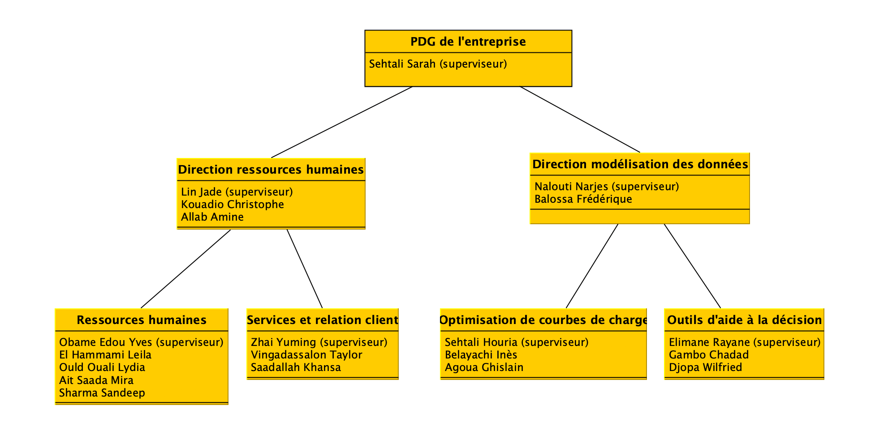
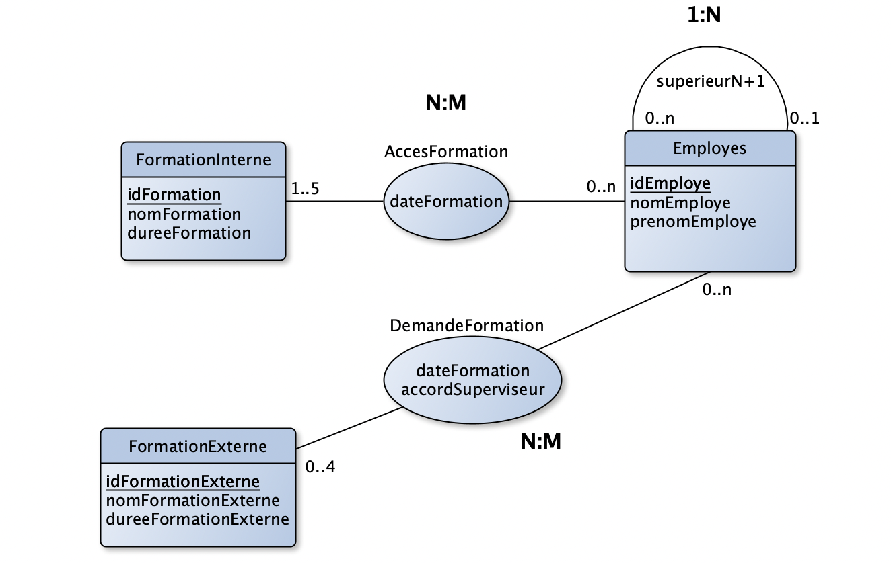
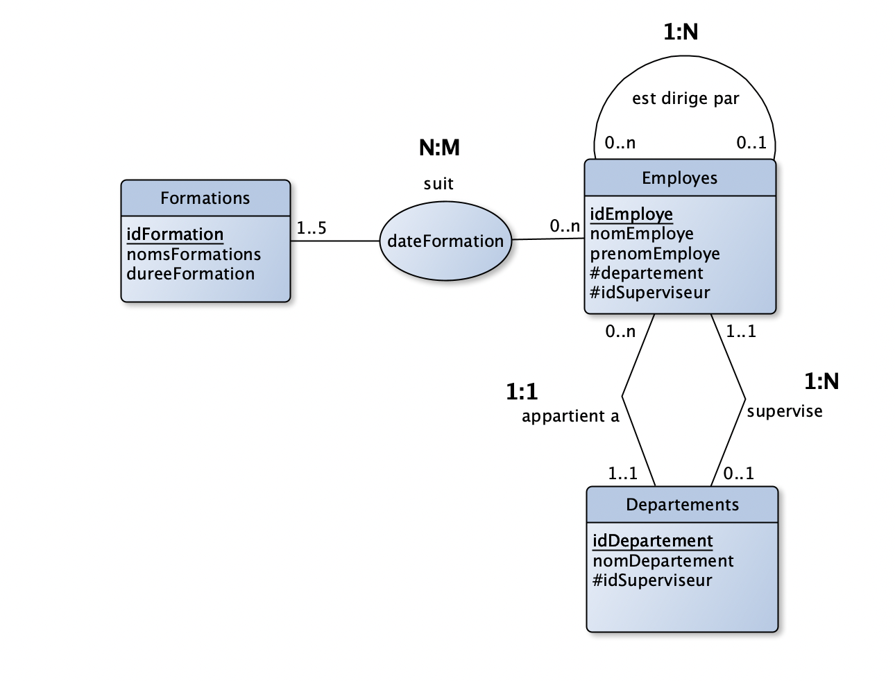

# Gestion d’un catalogue de formation via `sqlite3`

Ceci est l'ensemble des résultats obtenus lors la réalisation du projet du cours « Principes de bases de données » dans le cadre de Master 1 Traitement Automatique des Langues.

## Mise en situaion
Vous êtes nouvellement embauché dans le service administratif d’une entreprise. Votre travail consiste à mettre en place une base de données permettant de gérer des formations dans une entreprise. Votre objectif est d’optimiser l’accès et la gestion des formations pour les employés de l’entreprise. A votre arrivée, une collègue vous fournit les fichiers permettant d’accomplir ces tâches (au format `.csv`).
 

## PARTIE I. Conception
Dans votre entreprise, tous les employés ont accès à un catalogue de formation listant les formations internes auxquelles ils peuvent assister. Ils peuvent également participer à des formations externes si celles-ci sont acceptées par leur supérieur hiérarchique. En effet, les supérieurs hiérarchiques doivent valider l’intérêt de la formation pour leurs employés et vérifier qu’une formation similaire n’existe pas déjà dans le catalogue de formation interne. Toutes les formations suivies par un employé sont référencées dans la base de données et accessibles directement par leur supérieur direct. Un manager a donc accès à toutes les formations de ses employés. Cela fonctionne à un seul niveau : le responsable N+2 d’un employé n’a pas accès à ses formations, seulement à celles des employés du niveau hiérarchique N+1.
Dans la base de données, les employés sont identifiés par un numéro unique qui leur est attribué lors de leur embauche. Ce numéro leur permet de se connecter à la base de formations et d’en ajouter de nouvelles si leur manager leur permet. Un employé ne peut suivre que 5 formations par an (internes ou externes) et a l’obligation de suivre au moins une formation interne chaque année.

Un diagramme entité-association permettant de modéliser cette base de données : 

 
 
Schéma relationnel associé à ce diagramme :
- `Employes` (<ins>idEmploye</ins>,nomEmploye, prenomEmploye, #superieurN+1)
- `FormationInterne` (<ins>idFormation</ins>, nomFormation, dureeFormation)
- `FormationExterne` (<ins>idFormationExterne</ins>, nomFormationExterne, dureeFormation) 
- `AccesFormation` (<ins>#idFormation</ins>, <ins>#numEmploye</ins>, dateFormation)
- `DemandeFormation` (<ins>#idFormationExterne</ins>, <ins>#numEmploye</ins>, dateFormation, accordSuperviseur)

## PARTIE II. Implémentation

- **Exercice 1 :** Créer la base de données `Formation` et insérer les données avec SQLite3.
- **Exercice 2 :** Rédiger un script permettant d’afficher l’organigramme de l’entreprise contenant : le nombre total de départements, le nombre total d’employés, le nom de chaque département et de la personne qui le dirige et le nombre d’employés dans chaque département.
- **Exercice 3 :** Rédigez un script permettant de consulter toutes les formations effectuées par un employé ainsi que le nombre total de formations suivies et le volume horaire total que ça représente. L’employé sera donné en argument du script (en ligne de commande).
- **Exercice 4 :** Ici, on veut refaire la même chose que dans l’exercice 3 en jouant sur les droits utilisateurs. Pour cela, le nom du superviseur accédant à ces informations devra être spécifié. Si l’employé a accès à la formation de l’employé (s’il s’agit de son supérieur direct), alors il pourra accéder aux formations suivies par cet employé. Sinon, un message d’erreur apparaîtra à l’écran lui indiquant qu’il n’a pas accès à ces informations. La directrice de l’entreprise supervise deux départements. Les informations sur les deux départements seront donc affichées pour cette utilisatrice.
- **Exercice 5 :** Donnez à chaque manager la possibilité d’afficher le nombre de formations suivies cette année par ses employés directs et le volume horaire que cela représente, ainsi que le nombre de formations suivies pour chaque employé du département. La formation la plus populaire du département sera également affichée.
- **Exercice 6 :** Ici, on veut refaire la même chose que dans l’exercice 5 en affichant le résultat pour une date donnée. Par exemple, on voudra afficher les formations suivies à l’échelle du département et du groupe avant le 10 mars 2020.
- **Exercice 7 :** Afficher les formations qui n’ont pas été suivies dans le département cette année par ordre alphabétique et afficher les employés qui n’ont suivi aucune formation.
- **Exercice 8 :** Afficher le ou les employés ayant suivi au moins une formation mais qui a effectué le moins d’heures de formation.
- **Exercice 9 :** Donnez à chaque manager la possibilité d’afficher les employés qui ont rempli leur quota de formation pour l’année (ceux qui ont suivi 5 formations).
